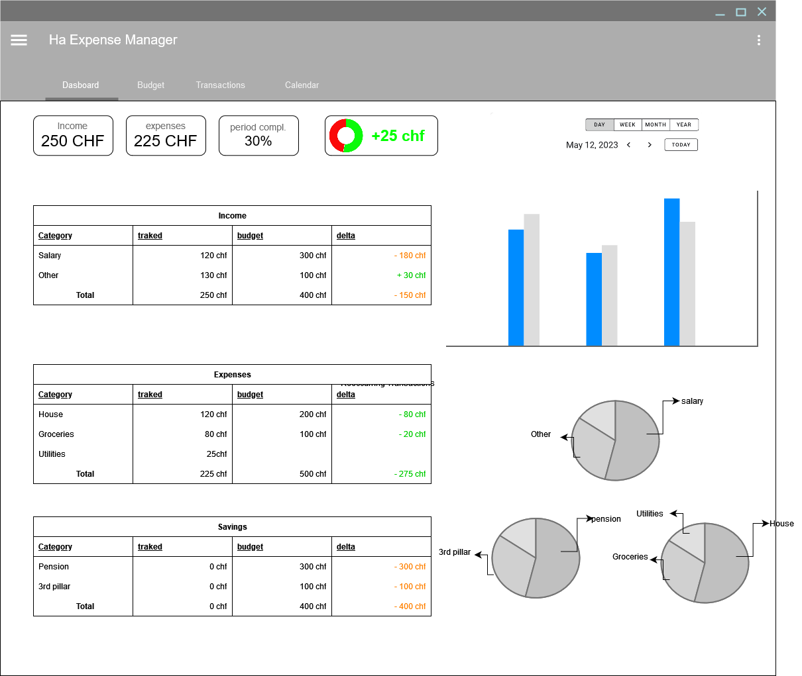
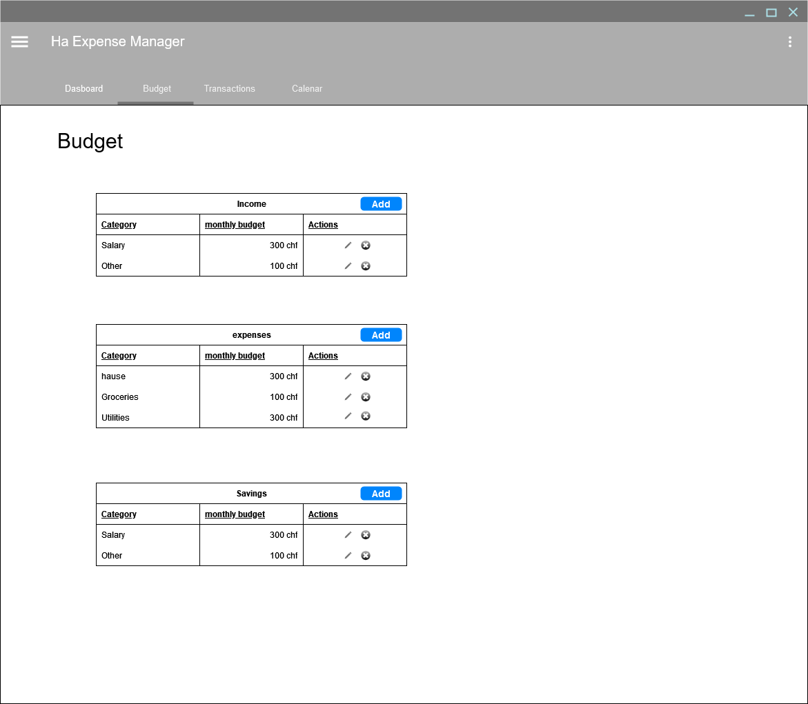
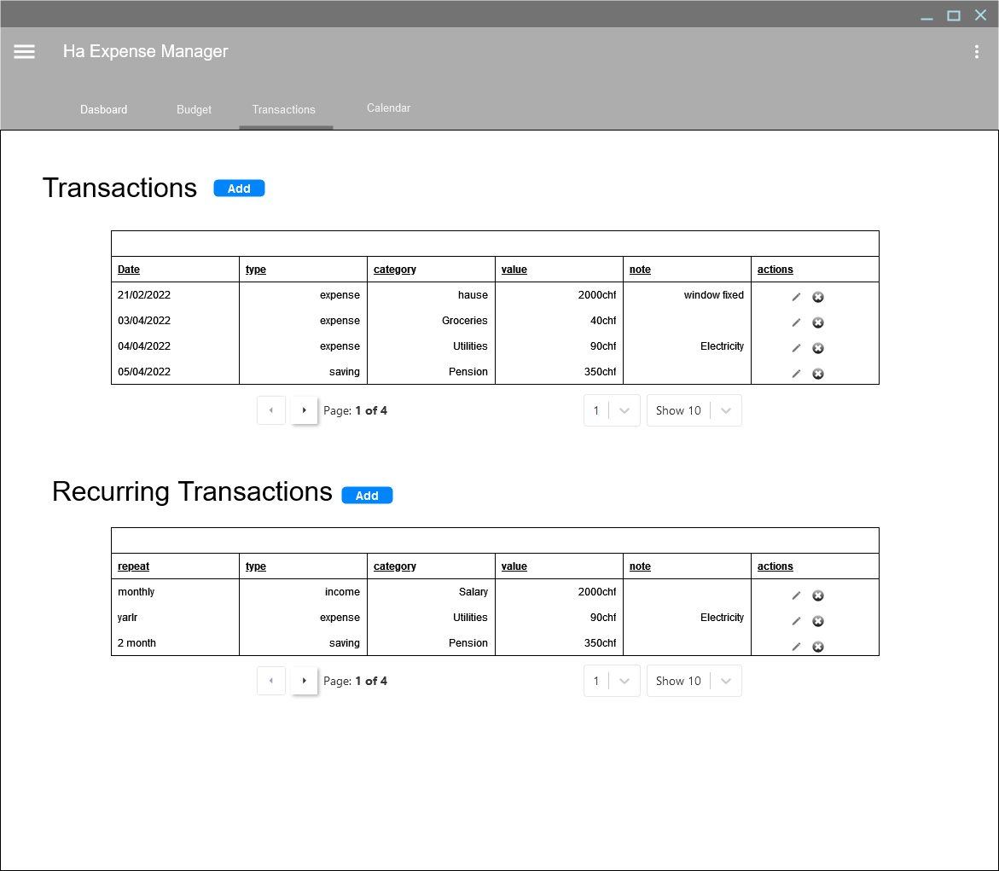
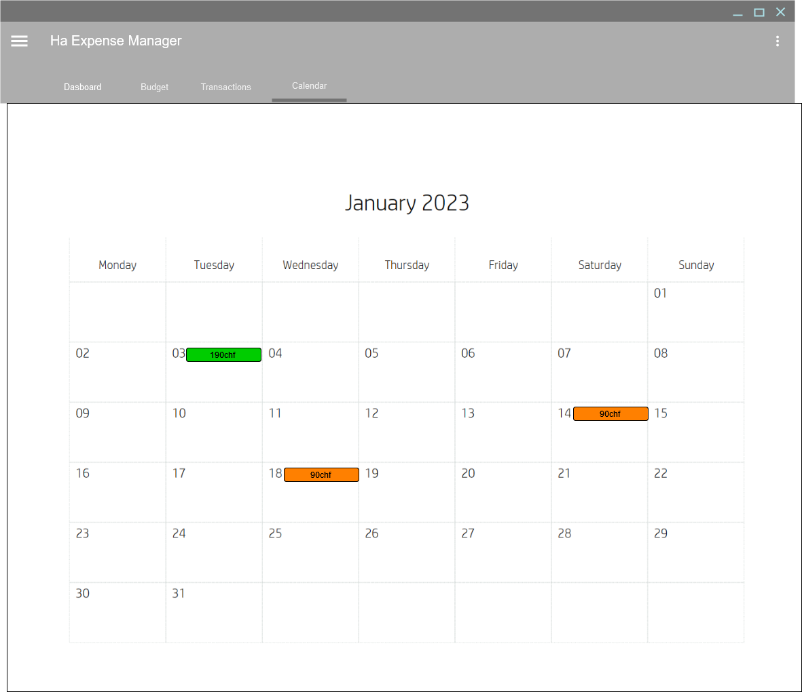

# HA Expense Manager

The aim of this project is to develope a simple to use application to stay on top of your expenses.

## Requirements

- Show at least monthly and yearly overview of income expenses and savings
- Creation of categories to differentiate transactions
- Creation of recurring transactions, aka Bills
- Show transactions in a calendar view, especially for bills
- Responsive design
- Good integration with home assistant

## Project status

### Creation of app wireframe ✅

the wireframe has been done with draw.io and it can be found in the wireframe folder

### UI implementation ❌

TODO

### Backend implementation ❌

TODO

### HA Integration ❌

TODO

### Deployment ❌

TODO
